# Lec 1 介绍数据库 & 关系模型 & SQL


## 基本概念

### 什么是数据库？

- 结构化数据的集合
  - 一般被组织成“记录”,  一般在磁盘上，数据量非常大
  - 以及记录之间的关系

- 这门课里面提到的数据库是指： DBMS。
  - 用来存储和查询数据库的软件系统。


### 数据库分类


**数据模型(data model) & 布局(layout)**

- 在数据库中构造和表示数据的系统方法
- 对数据一致性、共享数据、以及高效访问持久化数据非常重要
- 数据模型举例
  - 关系型 （大部分DBMS采用）
  - 非关系型
    - K/V
    - 文档/XML/对象
    - Wide-Column/Column-Family

  - Array/Matrix/Vectors (机器学习)
  - 过时
    - 分层
    - 网络
    - 多值


**Schema**

是指给定一个数据模型，对该数据集合（实体）的一种描述

**声明式查询**

- 数据库查询过程(query processing)
- 访问和操纵数据的算法

**一致性/事务("ACID")**

**关系模型术语与日常生活术语对比**


## 案例：动物园网站

### 特性

- 管理员接口
  - 编辑
  - 添加动物
- 公共设施
  - 图片 & 地图
- 动物饲养员
  - 喂养时间
- 1K个动物，5K个URL， 10个管理员，200个动物饲养员


### 动物园数据模型

#### 实体关系图


- 动物实体： 1名字、1年龄、1品种
- 饲养员实体： 1名字
- 笼子实体： 1清理时间、1建筑标号
- 一个笼子实体**包含**多个动物实体
- 一个动物饲养员看管多个笼子，一个笼子被多个饲养员看管

> 有其他比表集合更好的方式表示动物园数据吗？
>
>  不同的表示方法之间的权衡点在哪里？

#### 分层表示法

cage 1
	Tim
		giraffe
		13 yrs
	Sally
		student
		1 yr

cage 2
	Sam
		salamander
		3 yrs

#### 图表示法


####  扁平表示法

| name  | age  | species    | cageno | feedtime | bldg |
| ----- | ---- | ---------- | ------ | -------- | ---- |
| Tim   | 13   | giraffe    | 1      | 1:30     | 1    |
| Sam   | 3    | salamander | 2      | 2:30     | 2    |
| Sally | 1    | student    | 1      | 1:30     | 1    |

> 这是一个好的表示方法吗？ 为什么？

扁平化表示方法没有”规范化“（normalized)——数据重复了

### SQL

SQL，Structured Query Language，结构化查询语言

**查询长颈鹿的名称**

- 命令式

  ```python
  for each row r in animals:
    if r.species = 'giraffe':
      print(r.name)
  ```

- 声明式

  ```sql
  SELECT r.name FROM animals WHERE r.species = 'giraffe';
  ```


**查询32号建筑的笼子**

- 命令式

  ```python
  for each row a in animals:
    for each row c in cages:
      if a.cageno == c.no and c.bldg = 32:
      	print(a)
  ```

- 声明式

  ```sql
  SELECT a.name FROM animals AS a, cages AS c WHERE a.cageno = c.no AND c.bldg = 32
  ```

可以看出命令式用了嵌套循环，而声明式是用连接的方式。


**复杂的查询**


从上述例子中，我们得出结论，声明式查询**关注做什么，而不是怎么做**

- 对于给定的 SQL，有很多可能的程序计划
- 除了遍历所有记录，我们还能做些什么？
  - 按照动物类型进行排序
    - 这种排序方法对于特定类型（例如 "bears"）的查询非常有效，可以快速定位目标数据
    - 即插入操作会变慢，因为每次插入新记录时都需要保持排序顺序
  - 将动物表存储到哈希表中，或者树结构(“索引”）

#### SQL执行过程

```mermaid
graph TD;
    SQL["SQL"] --> ProceduralPlan["Procedural Plan程序计划"];
    ProceduralPlan --> OptimizedPlan["Optimized Plan优化计划"];
    OptimizedPlan --> CompiledProgram["Compiled Program编译程序"];
```




逻辑独立

- 如果我们想要更改schem而不更改代码呢？
- 如果我们只是添加一列或者一个表
- 视图允许我们将一个旧的schema映射到新的

视图

- 视图是一个将一个表表示其他表的逻辑定义
- 例子: 一个计算每个笼子的动物视图

```sql
CREATE VIEW cage_count as (SELECT cageno, count(*) FROM animal JOIN cages ON cageno=no GROUP by cageno)
```

- 例子： 如果我想添加多个喂养时间。
  - Rename existing animals table to animals2
  - Create feedtimes table
  - Copy feedtime data from animals
  - Remove feedtime column from animals
  - Create a view called animals that is a query over animals and feedtimes

```sql
CREATE VIEW animals as(
SELECT name, age, species,cageno,
	(SELECT feedtime FROM feedtimes WHERE animalid = id LIMIT 1) FROM animals
)
```

## 数据模型发展历史

### 不同的数据模型

- 分层数据模型（IMS/DL1)， 20世纪60年代
- 网络数据模型（CODASYL)， 20世纪70年代
- 关系数据模型， 20世纪70年代

### 主要观点

- 数据冗余（如何避免）
- 物理和逻辑数据独立
- 关系代数和公理

**案例： 动物园网站**


schema： 属性名称和属性类型

行，也称记录，或者元祖

----

对动物数据模型进行小更改

- 每个动物都在一个笼子里，多个动物可能共享一个笼子
- 每个动物被1个饲养员照顾，饲养员需要照看多个动物

### IMS（分层模型）

- 数据被组织称段segment

  - 段是记录的集合，每个段都有相同的段类型。段类型定义了记录的结构

  - IMS 中的数据按段类型排列成树状结构，例如

    ```
    Keepers
    	Animals
    		Cages
    
    or
    
    Keepers
    	Cages
    		Animals
    ```

- 段有不同的物理表示方式，决定了它们在存储和访问上的组织方式，比如

  - 无序
  - 可通过索引进行组织
    - 按某个关键字排序
    - 通过哈希函数组织

**分层表示的例子**

假如有两个饲养员，3个动物，2个笼子


这个例子中的物理表示方法为

```
Keeper1段
A1段   A2段  A3段   // A表animal
C1段   C2段  C3段   // C表cage
```


#### 段的结构

- 每个段都有一个特殊的物理表示方式
  - 由数据库管理员选择
- 段的结构选择影响到他们所支持的操作。

#### IMS、DL/1 的操作

- GetUnique(segtype, pred)

  - 从指定段类型中获取满足特定条件（pred）的第一个记录
  - 只有被组织成hash/有序段才能被支持

- GetNext(segtype, pred)

  - 获取层次结构中符合条件的第一个或下一个记录

  - 第一次调用 `GetNext("Animals", "type = 'salamander'")`：在 `Animals` 段中查找第一个类型为 "salamander" 的记录。

    后续调用 `GetNext("Animals", "type = 'salamander'")`：获取下一个类型为 "salamander" 的记录。

- GetNextParent(segtype, pred)

  - 类似 `GetNext`，但不会向上移动到层次结构中的下一个父段
  - 限制在当前父段内搜索。

- Delete， Insert

**例子**


**1、 找到饲养员Jane看管的所有笼子**

```
GetUnique(Keepers, name="Jane") // 将当前位置隐式地导航到 Jane 的记录。此时，系统在 Keepers 段内，指向 Jane 的记录

Until done:
  cageid = GetNextParent(cages).no  // 操作获取下一个笼子的记录
  print cageid
```

`GetNextParent` 操作会在当前父记录（即 Jane）的范围内查找 `cages` 段的记录，并获取该记录的 ID

**2、找到看管6号笼子的管理员**

```
keep = GetUnique(keepers)
Until done:
  cage = GetNextParent(cages, id=6)
  if (cage is not null):
  	print keep
 	keep = GetNext(keepers)
```

#### 缺点

- 数据重复，因为每个层次的节点都必须包含相关的子节点信息。
  - 在层次数据库中，完全避免数据冗余是很困难的，因为层次结构本身会导致某些数据项的重复出现。不同的层次结构设计可以在一定程度上减少冗余，但总会有某些部分的数据会重复存储。
- 低级编程接口的痛点，需要编写详细的搜索算法来遍历层次结构中的数据
- 物理数据独立性的限制
  - 如果根段的存储方式从索引改变为哈希，那么那些使用 `GetNext` 操作的程序可能会失败，因为哈希段不支持 `GetNext` 操作
  - 根段的类型改变，也会如此
  - 如果根段是顺序存储的，那么无法在中间插入新的记录
- 逻辑数据独立性的限制
  - 如果schema改变了，程序也要跟着改

#### 逻辑数据独立性

假设动物园管理层决定改变饲养员的工作方式：

- **旧制度**：一个饲养员负责多个笼子和笼子中的所有动物。
- **新制度**：一个饲养员只负责一个笼子及该笼子中的所有动物

这样一来，使用 `GN` 或 `GNP` 操作访问数据的程序必须更新，否则程序的行为可能不再符合预期

```
// 旧结构
Keepers
  cages
  	Animal
// 新结构
cages
  keepers
    Animal  
```

### CODASYL 数据模型

用来解决IMS/PL1的局限性，基于图或网络数据模型


记录能够根据一些key被hash或者排序。

**找到Joe看管的所有笼子**


```
Find keepers(name = 'Joe')
	Until done:
		Find next animal in caredforby
			Find cage in livesin
```

这种编程方法就像是在一个复杂的地图上找到一个起点，然后沿着路径进行导航

- 每一行代码都隐含在这个结构中的某个位置
- 需要记住你所在的位置

#### 缺点

- 非常复杂——导航式编程
- 程序缺乏物理或逻辑数据独立性:
  - 如果要修改数据库结构，就得改程序；
  - 也不能随便改物理表示，因为不同的索引类型支持的操作可能不一样。

**关系模型**就是为了解决这个问题的。

### 关系型数据模型

#### 原则

- 简单的表示方式

- 面向集合的编程模型，不需要"导航"

- 不需要物理数据模型的描述(!)
  - 例如，不需要指定排序顺序、哈希等

#### 基本特征

- **数据表示方式**：所有数据都以记录（元组）的形式存在于表格中。
- **表格属性**：表格是无序的集合，其中不包含重复的记录。
- **数据库结构**：数据库由一个或多个这样的表格组成。
- **模式描述**：每个表格（关系）都有一个模式，描述了表格中每个列或字段的类型。
- **字段类型**：每个字段都是基本数据类型，而不是集合或其他关系。
- **物理表示不指定**：关系模型不关注数据的物理存储方式，例如索引类型、嵌套结构等。

**例子说明**


## 关系代数

5个基本操作

- 投影Projection (π(T, c1, ... cn))
  - 选择部分列组成的子集
- 选择Selection(𝞂(T, pred))
  - 选择满足条件的行组成的子集
- 笛卡尔积(叉积，Cross Product) (T1 x T2)
  - 连接两个表
- 联接(⨝(T1, T2, pred)) = 𝞂(T1 x T2, pred)
  - 用一个判定条件联接两个表
- 集合的操作（并、差等）
- ”代数“——对其自身的操作具有封闭性。 大白话就是说， 无论对数据库中的哪个关系（表）进行什么样的操作，都会得到一个新的关系（表）


**用笛卡尔积实现连接**


**例子： 找到笼子号32的动物们**

```
𝞂(
	⨝ (
		animals,
		cages,
		animals.cageno = cages.no
	),
	bldg = 32
)
```

> 你觉得数据库就是这样实现代码？

```
⨝(
	animals,
	𝞂 (
		cages,
		bldg = 32
	),
	animals.cageno = cages.no
)
```


### 关系代数的等价规则

- 连接重排序(目的得到的Join记录最少，一般有贪心算法和动态规划算法)
  - A ⨝ B = B ⨝ A
  - (A ⨝ B) join C = A ⨝ (B ⨝ C)
- 选择重排序
  - 𝞂1(𝞂2(A)) = 𝞂2(𝞂1(A))
- 选择下推
  - 𝞂(A ⨝_pred B) = 𝞂(A) ⨝\_pred 𝞂(B)
  - 𝞂可能仅用于一个表
- 投影下推
  - π(𝞂(A)) = 𝞂(π(A))
  - 可以在应用投影操作之前或之后应用筛选操作，结果应该是一样的。前提是投影操作不会移除筛选条件中使用的字段
  - 同样能应用在连接

## 物理独立性

物理独立性是指可以更改数据的表示方式而无需修改代码的能力。

例子

```sql
SELECT a.name FROM animals AS a, cages AS c
WHERE a.cageno = c.no AND c.bldg = 32
```

在上述查询中，并没有明确指定动物和笼子表格的数据表示方式。它们可以是排序的、存储在哈希表或树中等。如果改变了数据的物理表示方式，SQL 查询本身不会改变。


## 逻辑独立性

逻辑数据独立性是指可以在不需要修改代码的情况下更改数据库schema。

- 如果只是添加一个列或者表格，这并不会造成问题。
- 视图（Views）允许我们将旧的模式映射到新的模式，使得旧的程序仍然可以正常工作。
- 即使是在修改现有字段的情况下，通过良好的视图设计，也可以确保旧程序与新模式的兼容性。

### 视图(View)简介

**视图**是一个基于其他表的逻辑定义表的方式。

例如， 一个视图可以计算每个笼子中的动物数量

```sql
CREATE VIEW cage_count AS
(SELECT cageno, count(*)
FROM animals JOIN cages ON animals.cageno = cages.no
GROUP BY cageno
)
```

这个视图可以像其他表一样在查询中使用。

**视图的例子**

>假设我想要添加多个喂食时间？
>
>如何支持旧程序？

- 将现有的 `animals` 表重命名为 `animals2`。
- 创建一个 `feedtimes` 表格。
- 从 `animals2` 中复制喂食时间数据。
- 从 `animals2` 中移除 `feedtime` 列。
- 创建一个名为 `animals` 的视图，该视图是对 `animals2` 和 `feedtimes` 表的查询

```sql
-- 创建一个名为 animals 的视图，查询 animals2 和 feedtimes 表
CREATE VIEW animals AS
SELECT a.name, a.age, a.species, a.cageno,
       (SELECT feedtime FROM feedtimes WHERE animalid = a.id LIMIT 1) AS feedtime
FROM animals2 a
);
```

## 总结： IMS vs. CODASYL vs. 关系型


## SQL

### Join（联接）

#### 引入


加入饲养员和笼子的关系如上所示

Schema:

- Animals: (aid, name, age, species, acageno)
- Cages(no, feedtime, bldg)
- Keepers(id, name)
- keeps(kid, cageno)


**找到32号建筑物中的所有笼子**

- 命令式

  ```
  for each row a in animals:
  	for each row c in cages:
  		if a.acageno = c.no and c.bldg = 32
  			output a
  ```

- 声明式

  ```sql
  SELECT name
  FROM animals, cages
  WHERE acageno = no AND bldg = 32;
  ```

- 另外一种声明式语法

  ```sql
  SELECT name
  FROM animals JOIN cages on acageno = no
  WHERE bldg = 32;
  ```

  

### 别名与歧义


**例子： 喂养熊的所有饲养员**

```sql
SELECT name FROM keepers JOIN keeps ON id = kid
JOIN cages on cageno = no
JOIN animals on cageno = no
Where species = 'bear'
```

> 这个sql语句并不能使用，为什么？

因为 SELECT name 时候这个name的指代不明确，没有指明是哪个实体。改成animals.name即可

### 聚合

**例子： 找到每个笼子由多少个饲养员管理**

```sql
SELECT no, count(*)
FROM cages JOIN keeps ON on=cageno
GROUP BY no
```

> 那没有饲养员管理的笼子呢？

可以使用右联或者外联

> [!IMPORTANT]
>
> count(*)， 所有行都被统计（包括NULL）
>
> count(col) ，只统计非空的值的行

### Join（联接）

#### 左联

```sql
T1 LEFT JOIN T2 ON pred
```

- 所有满足 `pred` 条件的 `T1 x T2` 行。

- 以及 `T1` 中没有与 `T2` 中任何行匹配的所有行（这些行的 `T2` 列值将为空）。

#### 右联

与左联类似，但是方向相反

```sql
T1 LEFT JOIN T2 ON pred
```

- 所有满足 `pred` 条件的 `T1 x T2` 行。

- 以及 `T2` 中没有与 `T1` 中任何行匹配的所有行（这些行的 `T1` 列值将为空）。

#### 外联/全联

即把左联结果表+右联结果表组合在一起，然后过滤掉重复的

```sql
T1 OUTER JOIN T2 ON pred
```

#### 内联（默认）

```sql
T1 INNER JOIN T2 ON pred
# 或者直接
T1 JOIN T2 ON pred
```

- 所有满足 `pred` 条件的 `T1 x T2` 行
- 如果某行在其中一个表中没有匹配的行，那么这行将不会出现在结果集中

#### 自联

**例子，查找照顾熊和长颈鹿的所有管理员**

```sql
SELECT keepers.name
FROM keepers JOIN keeps ON id = kid
JOIN cages ON cageno = no
JOIN animals ON acageno =cageno
WHERE species = 'Bear' AND = species = 'Giraffe'
```

> 这个SQL并没有效果，为什么？

需要构建两个表，Bear keepers 和 Giraffe keepers，然后取交集 

**先构建Bear keepers表**


**再构建Giraffe keepers表**


**最后联接**


## SQL必要练习 + 论文阅读

1、 [完成SQL的练习]([1. SQL — A Practical Introduction to Databases (runestone.academy)](https://runestone.academy/ns/books/published/practical_db/PART1_SQL/index.html))

2、 [完成关系模型（3.1节）的练习]([3. RELATIONAL DATABASE THEORY — A Practical Introduction to Databases (runestone.academy)](https://runestone.academy/ns/books/published/practical_db/PART3_RELATIONAL_DATABASE_THEORY/index.html))

3、 阅读参考书上的Michael Stonebraker和Joseph Hellerstein的文章《What Goes Around Comes Around》中的第1至4节

4、（可选）关系模型的开山鼻祖论文； E.F. Codd. A relational model of data for large shared data banks. Communications of the ACM, 1970.[[PDF](http://portal.acm.org/ft_gateway.cfm?id=362685&type=pdf&coll=GUIDE&dl=GUIDE&CFID=1781172&CFTOKEN=98614393)].

回答以下问题：

- 哪些类型的程序在SQL中编写起来容易？哪些类型的程序较难？
- 您觉得声明式编程比命令式编程更容易还是更难？
- 什么是数据独立性的概念？为什么它很重要？
- 关系模型背后的关键思想是什么？它们为何优于之前的模型？关系模型在哪些方面具有限制性？
- “分层”模型（如IMS系统）与Codd提出的关系模型之间最重要的区别是什么？
