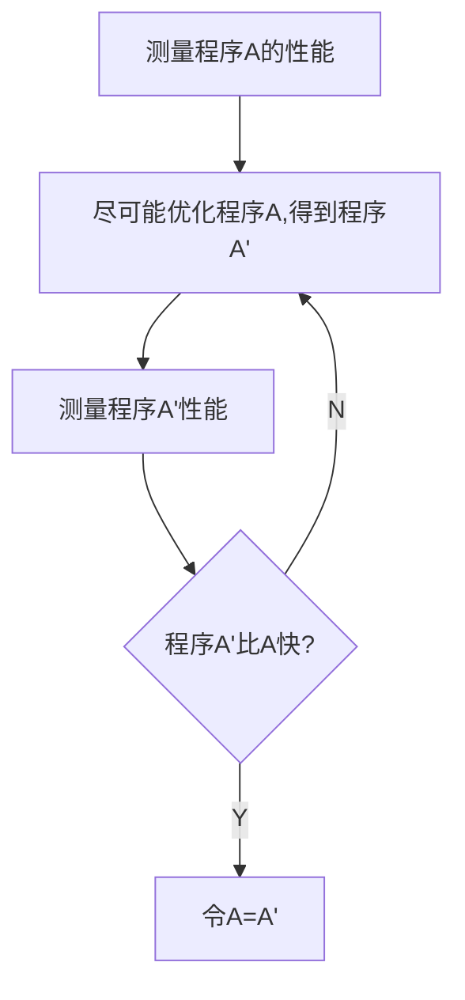

# Lec 10 测量和计时

Mytkoqicz, Todd, Amer Diwan, et al. “[Producing Wrong Data Without Doing Anything Obviously Wrong](https://doi.org/10.1145/1508284.1508275).” *Proceedings of the 14th International Conference on Architectural Support for Programming Languages and Operating Systems* (2009): 265–276. 

本节探讨如何可靠地测量软件的性能

## 大纲

- 静默系统(Quiescing System)
- 测量软件性能的工具
- 性能建模

[lec10.md](./lec10.md)

## 性能建模

基本工作流

**但是如果你无法可靠地测量出性能，那你就无法不断地做出的优化**

问题： 假设你在有一些干扰背景噪音的电脑上对一个确定性程序进行了100次性能测量（统计量是耗时时间）。以下什么统计量最能代表这个软件的原始性能呢？

- 算术平均值
- 几何平均
- 中位数
- 最大值
- 最小值

答案是 **最小值**； 最小值反映出在噪音抑制方面做得最好，因为我们期望任何高于最小值的测量都是由噪音引起的